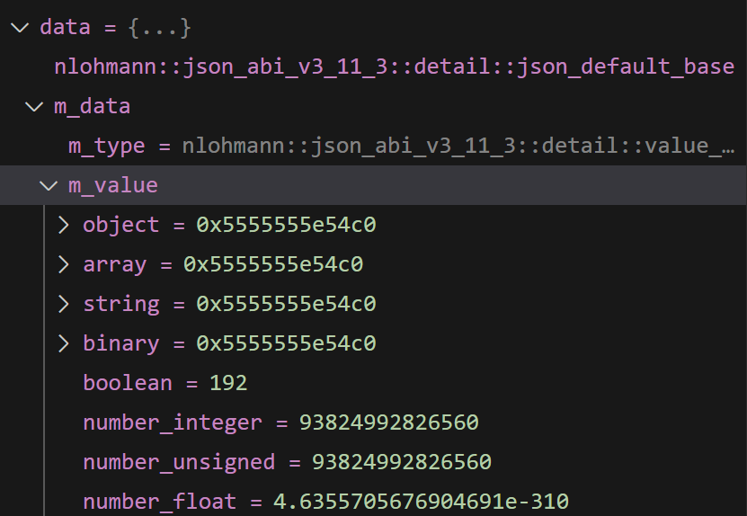
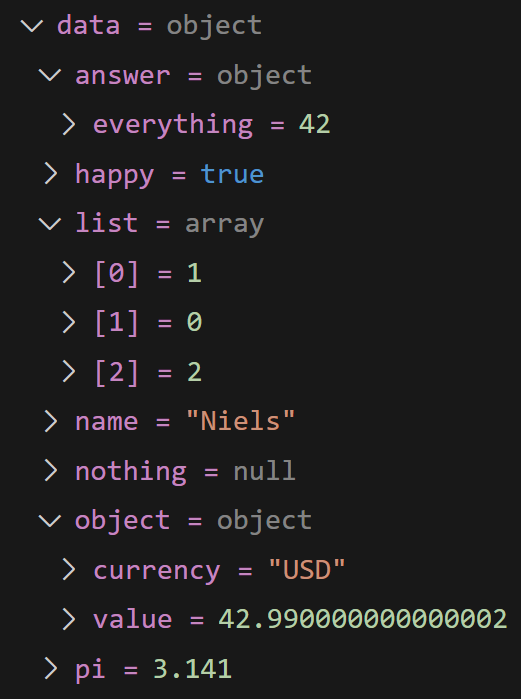

# nlohmann_json_pretty_printer
gdb pretty printer for nlohmann json

## Supported Version:
- [x] 3.11.3

You can try it, even your json version not in list. If it not work well, make a issue, tell me the json version.

## Breif

basic gdb can not show nlohmann json object well. For example, parse a json file below

```json
{
  "pi": 3.141,
  "happy": true,
  "name": "Niels",
  "nothing": null,
  "answer": {
    "everything": 42
  },
  "list": [1, 0, 2],
  "object": {
    "currency": "USD",
    "value": 42.99
  }
}
```

you will see json object in gdb like this


it's not friendly informed.

By use this pretty printer, you can see json object in gdb like this


it's more readable.

## How to use
There is a .gdbinit file in this repo. Just copy to your home dir. If you already have a .gdbinit file in you home dir, just copy
```python
sys.path.insert(0, "your_nlohmann_json_pretty_printer_dir")
import nlohmann_json_pretty_printer
nlohmann_json_pretty_printer.register_printer_gen(None)
```
to it.

In both way, you should change the `your_nlohmann_json_pretty_printer_dir` to the real directory. Then start gdb, it works.